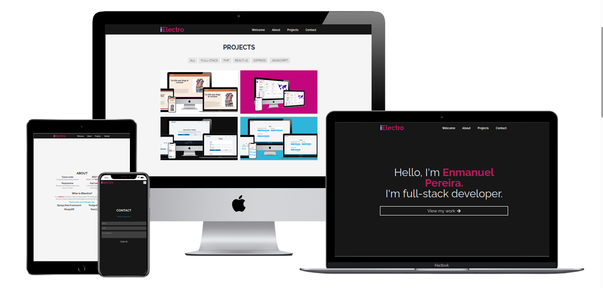
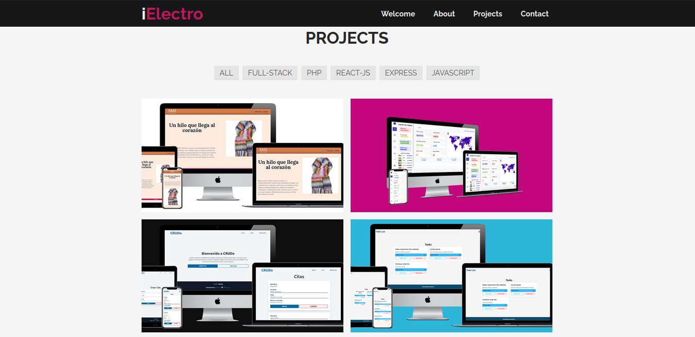
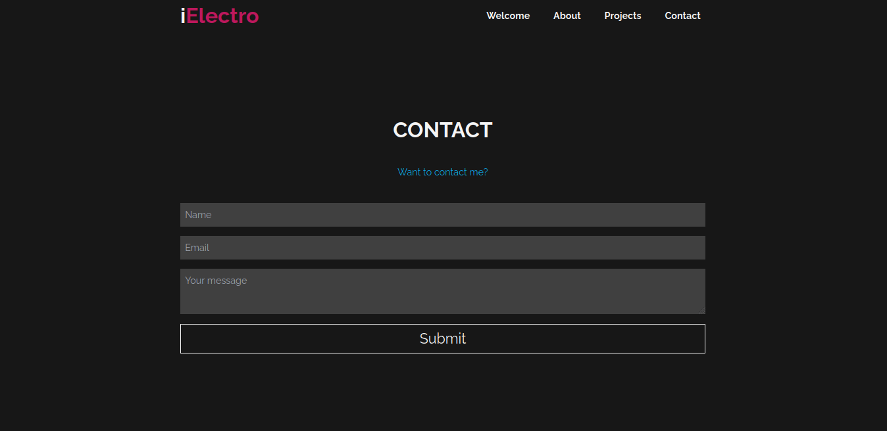

# iElectro's portfolio

This is my personal portfolio.





## Deploy
[iElectro's portfolio](https://i-electro-s-portfolio.vercel.app/ "iElectro's Porftolio")

## Installation
```bash
git clone https://github.com/iElectro13/iElectro-s-portfolio
```

```bash
cd ielectro-s-portfolio
```

```
npm install
```

## Usage

```bash
npm run dev
```

## Third-party's libraries
- [Formspree](https://formspree.io/ "Formspree")
- [react-router-dom](https://github.com/remix-run/react-router#readme "react-router-dom")
- [react-icons](https://react-icons.github.io/react-icons/ "react-icons")
- [tailwindcss](https://tailwindcss.com/ "tailwindcss")

## Roadmap

1) Backend


## Main features

- Contact form: Sends an email with the form info.
- Show my lastest projects.

## Directories
- assets/ : In this folder i’m going to place static files, like images, fonts, vídeos and
many others utility files.
- components/ : every component will be placed in this folder. Inside this folder i am
going to organize another folders by component category, like buttons, cards, etc.
- buttons/, cards/... : inside this kind of folders will be placed single React Components
beside it’s Test file.
- pages: In this folder all “pages” will be placed. In this project, “pages” means
complete sections, in order to route them later, so the user can navigate as any web
page.
- context/: In this folder i'm going to store the Context and Reducers files.

## Config files
- index.css : In this file i’m going to place any global css rule.
- App.jsx: In this file I'm going to route my application.
- nain.jsx: Config file.
- tailwind.config.js and postcss.config.js : these are CSS framework config files.

## Class components vs Functional components
In this project, functional components will be used. It’s completely prohibited to use class
components.

## Authors
[iElectro](https://github.com/iElectro13 "iElectro")
